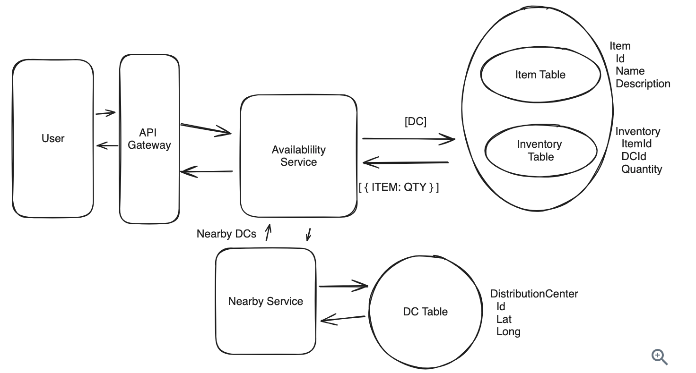
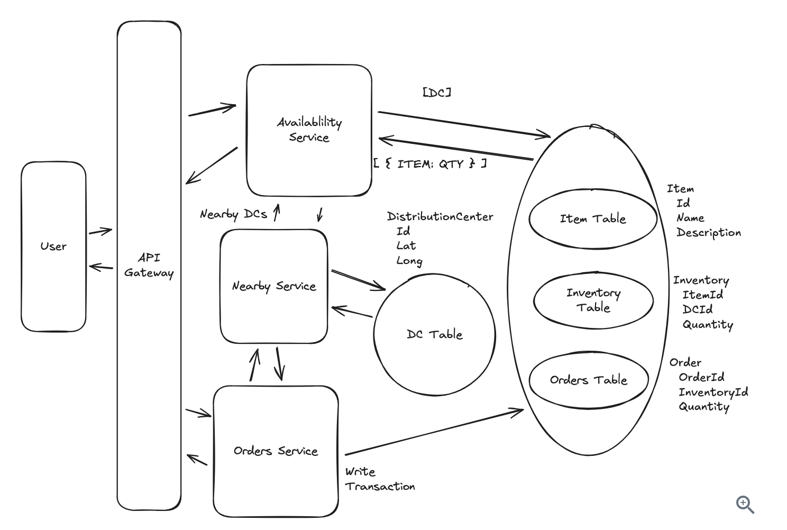

# 本地配送服务系统设计（Gopuff）

## 1. 问题理解

### 1.1 什么是 Gopuff

Gopuff 是一个快速配送服务，通过 500+ 个微型配送中心（Distribution Centers, DCs）提供便利店商品的 1 小时快速配送服务。

### 1.2 功能需求

**核心需求：**

1. 客户应该能够按位置查询商品的可用性（1 小时内可配送）
   - 有效可用性是所有附近 DC 库存的并集
2. 客户应该能够同时订购多个商品

**不在范围内（Below the line）：**

- 处理支付/购买
- 处理司机路由和配送
- 搜索功能和商品目录 API（系统严格关注可用性和订购）
- 取消和退货

**重点说明：**

- 本问题的重点是**聚合本地配送中心的商品可用性**
- 允许用户下单而不会重复预订

### 1.3 非功能需求

**核心需求：**

1. 可用性请求应该快速（<100ms），以支持搜索等用例
2. 订购应该是强一致性的：两个客户不应该能够购买同一个物理商品
3. 系统应该能够支持 10k 个 DC 和 100k 个商品
4. 订单量将达到 1000 万订单/天（O(10M orders/day)）

**不在范围内：**

- 隐私和安全
- 灾难恢复

---

## 2. 系统设计准备

### 2.1 核心实体定义

在设计之前，我们需要明确系统的核心"名词"。这些实体是构建整个系统的基础。

**核心实体：**

1. **Inventory（库存）**：

   - 定义：位于特定 DC 的商品的物理实例
   - 类比：类似于 OOP 中的"实例"（Instance）
   - 作用：通过汇总 Inventory 来确定特定用户可用的特定商品数量

2. **Item（商品）**：

   - 定义：商品类型，如"奇多（Cheetos）"
   - 类比：类似于 OOP 中的"类"（Class）
   - 作用：客户实际关心的商品类型

3. **DistributionCenter（配送中心）**：

   - 定义：存储商品的物理位置
   - 作用：确定哪些商品对用户可用
   - 关系：Inventory 存储在 DC 中

4. **Order（订单）**：
   - 定义：用户订购的 Inventory 集合（以及配送/账单信息）
   - 作用：跟踪订单状态和信息

**重要概念：Item vs Inventory**

这是本问题的关键区分：

- **Item**：商品类型（如"奇多"）- 目录中的逻辑概念
- **Inventory**：物理商品实例（如"1 号 DC 中的这包奇多"）- 实际的物理对象

```
Item: 奇多
  └─ Inventory 1: DC-001, 数量: 50
  └─ Inventory 2: DC-002, 数量: 30
  └─ Inventory 3: DC-003, 数量: 20
```

### 2.2 数据模型设计

#### Item 表

```json
{
  "itemId": "item-123",
  "name": "Cheetos",
  "description": "Crunchy cheese snack",
  "category": "Snacks",
  "price": 3.99,
  "imageUrl": "https://cdn.example.com/cheetos.jpg"
}
```

#### DistributionCenter 表

```json
{
  "dcId": "dc-001",
  "name": "SF Downtown DC",
  "latitude": 37.7749,
  "longitude": -122.4194,
  "address": "123 Market St, SF",
  "capacity": 10000
}
```

#### Inventory 表

```json
{
  "inventoryId": "inv-456",
  "itemId": "item-123",
  "dcId": "dc-001",
  "quantity": 50,
  "lastUpdated": "2026-02-01T10:00:00Z"
}
```

**索引设计：**

- 主键：`inventoryId`
- 复合索引：`(dcId, itemId)` - 用于快速查询特定 DC 的特定商品

#### Order 表

```json
{
  "orderId": "order-789",
  "userId": "user-001",
  "dcId": "dc-001",
  "items": [
    {
      "itemId": "item-123",
      "quantity": 2,
      "price": 3.99
    }
  ],
  "totalAmount": 7.98,
  "status": "pending",
  "deliveryAddress": "456 Oak St",
  "createdAt": "2026-02-01T10:00:00Z"
}
```

### 2.3 API 设计

我们需要两个核心 API 来满足功能需求：

#### API 1: 查询商品可用性

```http
GET /api/v1/availability
Query Parameters:
  - lat: 37.7749 (用户纬度)
  - lon: -122.4194 (用户经度)
  - keyword: "snacks" (可选，用于过滤)
  - page: 1
  - limit: 20

Response:
{
  "items": [
    {
      "itemId": "item-123",
      "name": "Cheetos",
      "price": 3.99,
      "availableQuantity": 100, // 所有附近DC的总和
      "imageUrl": "..."
    }
  ],
  "pagination": {
    "page": 1,
    "limit": 20,
    "total": 1000
  }
}
```

**设计考虑：**

- 位置信息通过查询参数传递
- 包含分页以避免返回过多数据
- 返回的是聚合后的可用性（所有附近 DC 的总和）

#### API 2: 下单

```http
POST /api/v1/orders
Headers:
  - Authorization: Bearer <token>

Request:
{
  "items": [
    {
      "itemId": "item-123",
      "quantity": 2
    }
  ],
  "deliveryAddress": {
    "street": "456 Oak St",
    "city": "San Francisco",
    "lat": 37.7749,
    "lon": -122.4194
  }
}

Response:
{
  "orderId": "order-789",
  "status": "confirmed",
  "estimatedDeliveryTime": "2026-02-01T11:00:00Z",
  "totalAmount": 7.98
}
```

**设计考虑：**

- 位置信息在请求体中传递（需要验证库存可用性）
- 包含认证信息（Bearer token）
- 返回订单确认和预计配送时间

---

## 3. 高层设计

### 3.1 需求 1：查询商品可用性

#### 设计目标

- 根据用户位置查询可用商品
- 延迟 < 100ms
- 返回所有附近 DC 的聚合库存

#### 实现步骤

**步骤 1：找到附近的配送中心**

我们需要一个内部服务来查找 1 小时配送范围内的 DC。

**方案 A：简单距离计算（初始方案）**

```
Nearby Service (基础版)
  ↓
输入：(latitude, longitude)
  ↓
查询 DC 表
  ↓
计算距离（欧几里得距离或 Haversine 公式）
  ↓
返回：距离 < 阈值的 DC 列表
```

**距离计算方法：**

1. **欧几里得距离**：简单的直线距离

   ```
   distance = sqrt((lat1-lat2)² + (lon1-lon2)²)
   ```

2. **Haversine 公式**：考虑地球曲率的距离
   ```javascript
   function haversineDistance(lat1, lon1, lat2, lon2) {
     const R = 6371; // 地球半径（公里）
     const dLat = toRadians(lat2 - lat1);
     const dLon = toRadians(lon2 - lon1);
     const a =
       Math.sin(dLat / 2) * Math.sin(dLat / 2) +
       Math.cos(toRadians(lat1)) *
         Math.cos(toRadians(lat2)) *
         Math.sin(dLon / 2) *
         Math.sin(dLon / 2);
     const c = 2 * Math.atan2(Math.sqrt(a), Math.sqrt(1 - a));
     return R * c;
   }
   ```

**局限性：**

- 直线距离 ≠ 实际行驶时间
- 不考虑交通状况、道路情况
- 需要改进（见深入探讨部分）

**步骤 2：查询库存**

```
Availability Service
  ↓
调用 Nearby Service 获取 DC 列表
  ↓
查询 Inventory 表（WHERE dcId IN (dc_list)）
  ↓
JOIN Item 表获取商品详情
  ↓
GROUP BY itemId 并 SUM(quantity)
  ↓
返回聚合后的可用性
```

**SQL 示例：**

```sql
-- 查询指定 DC 列表中的商品可用性
SELECT
  i.itemId,
  i.name,
  i.price,
  i.imageUrl,
  SUM(inv.quantity) as availableQuantity
FROM Inventory inv
JOIN Item i ON inv.itemId = i.itemId
WHERE inv.dcId IN ('dc-001', 'dc-002', 'dc-003')
  AND inv.quantity > 0
GROUP BY i.itemId, i.name, i.price, i.imageUrl
ORDER BY i.name
LIMIT 20 OFFSET 0;
```

#### 初始架构



---

### 3.2 需求 2：下单

#### 设计目标

- 支持多商品订单
- 强一致性：避免超售
- 原子性：订单要么全部成功，要么全部失败

#### 核心挑战：避免超售

**问题场景：**

```
时间 T0: DC-001 有 1 个 Cheetos
时间 T1: 用户 A 查询，看到有 1 个
时间 T2: 用户 B 查询，看到有 1 个
时间 T3: 用户 A 下单，库存变为 0
时间 T4: 用户 B 下单，库存变为 -1 ❌（超售！）
```

#### 解决方案对比

##### ❌ 方案一：先查后减（有竞态条件）

```javascript
// 伪代码 - 有问题的实现
async function placeOrder(items) {
  // 步骤 1: 检查库存
  for (let item of items) {
    const inventory = await db.query(
      "SELECT quantity FROM Inventory WHERE itemId = ?",
      item.itemId
    );
    if (inventory.quantity < item.quantity) {
      throw new Error("库存不足");
    }
  }

  // 步骤 2: 减少库存（❌ 可能超售）
  for (let item of items) {
    await db.query(
      "UPDATE Inventory SET quantity = quantity - ? WHERE itemId = ?",
      item.quantity,
      item.itemId
    );
  }

  // 步骤 3: 创建订单
  await db.query("INSERT INTO Order ...");
}
```

**问题：** 在步骤 1 和步骤 2 之间，其他请求可能修改库存，导致超售。

##### ✅ 方案二：数据库事务 + 悲观锁

```javascript
async function placeOrder(userId, items, deliveryAddress) {
  const transaction = await db.beginTransaction();

  try {
    // 步骤 1: 锁定并检查库存（SELECT ... FOR UPDATE）
    for (let item of items) {
      const inventory = await transaction.query(
        "SELECT quantity FROM Inventory WHERE itemId = ? FOR UPDATE",
        item.itemId
      );

      if (inventory.quantity < item.quantity) {
        await transaction.rollback();
        throw new Error("库存不足");
      }
    }

    // 步骤 2: 减少库存
    for (let item of items) {
      await transaction.query(
        "UPDATE Inventory SET quantity = quantity - ? WHERE itemId = ?",
        item.quantity,
        item.itemId
      );
    }

    // 步骤 3: 创建订单
    const orderId = await transaction.query(
      "INSERT INTO Order (userId, items, address, status) VALUES (?, ?, ?, ?)",
      userId,
      JSON.stringify(items),
      deliveryAddress,
      "confirmed"
    );

    // 提交事务
    await transaction.commit();
    return orderId;
  } catch (error) {
    await transaction.rollback();
    throw error;
  }
}
```

**关键点：**

- `SELECT ... FOR UPDATE`：悲观锁，锁定行直到事务结束
- 事务保证原子性：全部成功或全部失败
- 回滚机制：失败时自动恢复

##### ⭐ 方案三：乐观锁（高并发场景）

```sql
-- 使用版本号的乐观锁
UPDATE Inventory
SET quantity = quantity - ?,
    version = version + 1
WHERE itemId = ?
  AND quantity >= ?
  AND version = ?;  -- 只有版本号匹配才更新

-- 检查影响的行数
-- 如果 = 0，说明版本号已变化（有其他请求修改了），需要重试
```

**优点：**

- 不需要长时间持有锁
- 适合读多写少的场景
- 更好的并发性能

**缺点：**

- 需要重试逻辑
- 高并发下重试次数可能较多

#### Order Service 架构

```
┌─────────────┐
│   客户端     │
└──────┬──────┘
       │ POST /orders
       │
┌──────▼──────────────┐
│  Order Service      │
│  - 验证库存         │
│  - 创建订单         │
│  - 扣减库存         │
└──────┬──────────────┘
       │
       │ 数据库事务
       │
┌──────▼──────────────────────────┐
│  PostgreSQL                     │
│  ┌────────────┐  ┌────────────┐ │
│  │ Inventory  │  │   Order    │ │
│  │   Table    │  │   Table    │ │
│  └────────────┘  └────────────┘ │
└─────────────────────────────────┘
```

---

### 3.3 完整架构图（初始版）


---

## 4. 深入探讨与优化

### 4.1 优化 1：使用真实交通时间而非直线距离

#### 问题分析

直线距离无法准确反映配送时间：

- 可能有河流、山脉阻隔
- 道路状况不同
- 交通拥堵情况
- 单行道、红绿灯等

**示例：**

```
DC-A: 直线距离 3km，实际驾驶时间 25 分钟（穿越市区）
DC-B: 直线距离 5km，实际驾驶时间 15 分钟（高速公路）
→ 应该选择 DC-B
```

#### 解决方案：集成外部地图服务

##### 架构设计

```
┌────────────────┐
│ Nearby Service │
└────────┬───────┘
         │
         ├──→ 本地缓存查询
         │    (Redis)
         │
         ├──→ 数据库查询
         │    (预计算的路线)
         │
         └──→ 外部地图 API
              (Google Maps/Mapbox)
```

##### 实现策略

**策略 A：实时查询（不推荐）**

```javascript
async function getNearbyDCs(userLat, userLon) {
  const allDCs = await db.query("SELECT * FROM DistributionCenter");
  const nearbyDCs = [];

  for (let dc of allDCs) {
    // 调用外部 API 获取实际驾驶时间
    const travelTime = await mapsAPI.getDrivingTime(
      userLat,
      userLon,
      dc.latitude,
      dc.longitude
    );

    if (travelTime <= 60) {
      // 60 分钟内
      nearbyDCs.push({ ...dc, travelTime });
    }
  }

  return nearbyDCs;
}
```

**问题：**

- 延迟高（每个 DC 都要调用外部 API）
- 成本高（API 调用费用）
- 可靠性低（依赖外部服务）

**策略 B：预计算 + 缓存（推荐）**

```javascript
// 1. 离线预计算：定期计算 DC 之间的旅行时间
async function precomputeTravelTimes() {
  const dcs = await db.query('SELECT * FROM DistributionCenter');

  // 将地理区域划分为网格
  const grid = createGrid(boundingBox, gridSize = 1km);

  for (let dc of dcs) {
    for (let cell of grid) {
      const travelTime = await mapsAPI.getDrivingTime(
        cell.center.lat, cell.center.lon,
        dc.latitude, dc.longitude
      );

      // 保存到数据库
      await db.query(
        'INSERT INTO TravelTimeCache VALUES (?, ?, ?)',
        dc.id, cell.id, travelTime
      );
    }
  }
}

// 2. 运行时查询：使用预计算的数据
async function getNearbyDCs(userLat, userLon) {
  // 找到用户所在的网格
  const cellId = findGridCell(userLat, userLon);

  // 查询缓存的旅行时间
  const nearbyDCs = await db.query(`
    SELECT dc.*, ttc.travelTime
    FROM DistributionCenter dc
    JOIN TravelTimeCache ttc ON dc.id = ttc.dcId
    WHERE ttc.cellId = ?
      AND ttc.travelTime <= 60
    ORDER BY ttc.travelTime ASC
  `, cellId);

  return nearbyDCs;
}
```

**优点：**

- 查询快速（本地数据库）
- 成本低（减少 API 调用）
- 可靠性高（不依赖实时外部服务）

**权衡：**

- 需要存储空间（网格数 × DC 数）
- 需要定期更新（道路变化、交通模式变化）
- 不完全实时（但对于大多数场景足够好）

##### 网格大小选择

**计算示例：**

```
假设：
- 服务区域：100km × 100km = 10,000 km²
- 网格大小：1km × 1km
- 网格数量：10,000 个
- DC 数量：10,000 个
- 存储：10,000 × 10,000 × 8 bytes = 800 MB

较粗网格（5km）：
- 网格数量：400 个
- 存储：400 × 10,000 × 8 bytes = 32 MB
```

**建议：**

- 城市中心：使用较细网格（0.5-1km）
- 郊区：使用较粗网格（5-10km）
- 自适应网格：根据 DC 密度调整

---

### 4.2 优化 2：扩展可用性查询性能

#### 问题分析：查询量估算

根据非功能需求：

- 订单量：10M orders/day
- 假设转化率：5%（20 个浏览者中 1 个下单）
- 假设每个用户浏览页面数：10 页
- 一天的秒数：~100k 秒

**计算：**

```
查询量 = 10M orders/day / 0.05 * 10 页 / 100k 秒/天
      = 200M 页面浏览 / 100k 秒
      = 2,000 页面/秒

假设每页查询一次可用性：
可用性查询 = 2,000 QPS
实际可能更高（考虑搜索、筛选等）≈ 20,000 QPS
```

**20,000 QPS** 是一个相当大的查询量，需要优化。

#### 解决方案 A：Redis 缓存

##### 缓存策略设计

```javascript
// 缓存键设计
const cacheKey = `availability:${gridCellId}:${itemId}`;

async function getAvailability(userLat, userLon, page = 1, limit = 20) {
  const cellId = findGridCell(userLat, userLon);

  // 1. 尝试从缓存获取
  const cached = await redis.get(`availability:${cellId}`);
  if (cached) {
    return JSON.parse(cached).slice((page - 1) * limit, page * limit);
  }

  // 2. 缓存未命中，查询数据库
  const nearbyDCs = await getNearbyDCs(userLat, userLon);
  const dcIds = nearbyDCs.map((dc) => dc.id);

  const availability = await db.query(
    `
    SELECT 
      i.itemId,
      i.name,
      i.price,
      SUM(inv.quantity) as availableQuantity
    FROM Inventory inv
    JOIN Item i ON inv.itemId = i.itemId
    WHERE inv.dcId IN (?)
      AND inv.quantity > 0
    GROUP BY i.itemId
  `,
    dcIds
  );

  // 3. 写入缓存
  await redis.setex(
    `availability:${cellId}`,
    60, // TTL: 60 秒
    JSON.stringify(availability)
  );

  return availability.slice((page - 1) * limit, page * limit);
}
```

**缓存失效策略：**

```javascript
// 当库存更新时，使缓存失效
async function updateInventory(dcId, itemId, quantityChange) {
  // 1. 更新数据库
  await db.query(
    `
    UPDATE Inventory 
    SET quantity = quantity + ?
    WHERE dcId = ? AND itemId = ?
  `,
    quantityChange,
    dcId,
    itemId
  );

  // 2. 找到受影响的网格
  const affectedCells = await findAffectedGridCells(dcId);

  // 3. 使缓存失效
  for (let cellId of affectedCells) {
    await redis.del(`availability:${cellId}`);
  }
}
```

**缓存配置：**

- **TTL（过期时间）**：30-60 秒
  - 太短：缓存命中率低
  - 太长：数据不够新鲜
- **内存大小**：
  ```
  假设：
  - 网格数：10,000
  - 每个网格缓存大小：~100 KB（包含所有商品）
  - 总内存：10,000 × 100 KB = 1 GB
  ```

**缓存架构：**

```
┌────────────────┐
│Availability    │
│Service         │
└────┬───────────┘
     │
     ├──→ Redis 缓存
     │    (TTL: 60s)
     │    ↓
     │    命中 → 返回
     │    未命中 ↓
     │
     └──→ PostgreSQL
          ↓
          查询并缓存
```

#### 解决方案 B：PostgreSQL 读副本 + 分区

##### 读副本架构

```
                    写操作
                      ↓
              ┌───────────────┐
              │  Master DB    │ (写)
              └───────┬───────┘
                      │ 复制
         ┌────────────┼────────────┐
         │            │            │
    ┌────▼───┐  ┌────▼───┐  ┌────▼───┐
    │Replica1│  │Replica2│  │Replica3│ (读)
    └────────┘  └────────┘  └────────┘
         ↑            ↑            ↑
         └────────────┴────────────┘
                 读操作
           (负载均衡分配)
```

**读写分离实现：**

```javascript
// 数据库连接池配置
const masterDB = createPool({
  host: "master.db.example.com",
  // ... 其他配置
});

const replicaDBs = [
  createPool({ host: "replica1.db.example.com" }),
  createPool({ host: "replica2.db.example.com" }),
  createPool({ host: "replica3.db.example.com" }),
];

// 读操作：使用副本（轮询负载均衡）
let replicaIndex = 0;
function getReadDB() {
  replicaIndex = (replicaIndex + 1) % replicaDBs.length;
  return replicaDBs[replicaIndex];
}

// 写操作：使用主库
async function placeOrder(orderData) {
  return masterDB.query("INSERT INTO Order ...", orderData);
}

// 读操作：使用副本
async function getAvailability(location) {
  return getReadDB().query("SELECT ...", location);
}
```

##### 数据库分区（Partitioning）

**按 DC 分区：**

```sql
-- 创建分区表
CREATE TABLE Inventory (
  inventoryId SERIAL,
  itemId INTEGER,
  dcId INTEGER,
  quantity INTEGER,
  lastUpdated TIMESTAMP
) PARTITION BY HASH (dcId);

-- 创建分区
CREATE TABLE Inventory_p0 PARTITION OF Inventory
  FOR VALUES WITH (MODULUS 4, REMAINDER 0);

CREATE TABLE Inventory_p1 PARTITION OF Inventory
  FOR VALUES WITH (MODULUS 4, REMAINDER 1);

CREATE TABLE Inventory_p2 PARTITION OF Inventory
  FOR VALUES WITH (MODULUS 4, REMAINDER 2);

CREATE TABLE Inventory_p3 PARTITION OF Inventory
  FOR VALUES WITH (MODULUS 4, REMAINDER 3);
```

**优点：**

- 查询只扫描相关分区，速度更快
- 更好的并行处理能力
- 更容易扩展

**查询性能对比：**

```
无分区：扫描 100M 行 → 10 秒
分区 (4 个)：扫描 25M 行 → 2.5 秒
```

#### 综合方案：缓存 + 读副本 + 分区

```
┌─────────────────┐
│  Availability   │
│  Service        │
└────┬────────────┘
     │
     ├──→ Redis 缓存 (L1)
     │    TTL: 60s
     │    命中率: ~80%
     │
     └──→ PostgreSQL 读副本 (L2)
          - 3 个副本
          - 按 DC 分区
          - 查询时间: <50ms
```

**性能提升：**

```
原始方案：
- 20,000 QPS
- 每个查询 200ms
- 需要 4,000 个并发连接

优化后：
- 缓存处理：16,000 QPS（80% 命中）
- 数据库处理：4,000 QPS（20% 未命中）
- 每个查询 <10ms（缓存）或 <50ms（数据库）
- 需要 <200 个并发连接
```

---

### 4.3 优化 3：订单处理优化

#### 挑战：处理并发订单

在高并发场景下，数据库锁可能成为瓶颈。

**问题：**

```
1000 个用户同时购买同一商品
  ↓
1000 个事务同时锁定同一行
  ↓
串行处理，吞吐量低
```

#### 解决方案：预留库存（Reservation）

```javascript
// 两阶段提交：预留 → 确认

// 阶段 1：预留库存（软锁定）
async function reserveInventory(items, timeout = 300) {
  const reservationId = generateUUID();
  const expiresAt = Date.now() + timeout * 1000;

  await db.transaction(async (tx) => {
    for (let item of items) {
      // 检查可用库存（排除已预留的）
      const available = await tx.query(
        `
        SELECT 
          quantity - COALESCE(reserved, 0) as availableQty
        FROM Inventory
        WHERE itemId = ? AND dcId = ?
        FOR UPDATE
      `,
        item.itemId,
        item.dcId
      );

      if (available.availableQty < item.quantity) {
        throw new Error("库存不足");
      }

      // 增加预留数量
      await tx.query(
        `
        UPDATE Inventory
        SET reserved = reserved + ?
        WHERE itemId = ? AND dcId = ?
      `,
        item.quantity,
        item.itemId,
        item.dcId
      );

      // 记录预留信息
      await tx.query(
        `
        INSERT INTO Reservation 
        (reservationId, itemId, dcId, quantity, expiresAt)
        VALUES (?, ?, ?, ?, ?)
      `,
        reservationId,
        item.itemId,
        item.dcId,
        item.quantity,
        expiresAt
      );
    }
  });

  return { reservationId, expiresAt };
}

// 阶段 2：确认订单（永久扣减）
async function confirmOrder(reservationId, orderDetails) {
  await db.transaction(async (tx) => {
    // 获取预留信息
    const reservations = await tx.query(
      `
      SELECT * FROM Reservation
      WHERE reservationId = ?
        AND expiresAt > NOW()
    `,
      reservationId
    );

    if (reservations.length === 0) {
      throw new Error("预留已过期");
    }

    // 扣减实际库存
    for (let res of reservations) {
      await tx.query(
        `
        UPDATE Inventory
        SET quantity = quantity - ?,
            reserved = reserved - ?
        WHERE itemId = ? AND dcId = ?
      `,
        res.quantity,
        res.quantity,
        res.itemId,
        res.dcId
      );
    }

    // 创建订单
    const orderId = await tx.query(
      `
      INSERT INTO Order (userId, items, status, ...)
      VALUES (?, ?, 'confirmed', ...)
    `,
      orderDetails
    );

    // 删除预留记录
    await tx.query(
      `
      DELETE FROM Reservation
      WHERE reservationId = ?
    `,
      reservationId
    );

    return orderId;
  });
}

// 后台任务：清理过期预留
async function cleanupExpiredReservations() {
  setInterval(async () => {
    await db.transaction(async (tx) => {
      // 查找过期预留
      const expired = await tx.query(`
        SELECT * FROM Reservation
        WHERE expiresAt <= NOW()
      `);

      // 释放预留库存
      for (let res of expired) {
        await tx.query(
          `
          UPDATE Inventory
          SET reserved = reserved - ?
          WHERE itemId = ? AND dcId = ?
        `,
          res.quantity,
          res.itemId,
          res.dcId
        );
      }

      // 删除过期记录
      await tx.query(`
        DELETE FROM Reservation
        WHERE expiresAt <= NOW()
      `);
    });
  }, 60000); // 每分钟运行一次
}
```

**优点：**

- 用户有时间完成支付
- 减少锁竞争
- 更好的用户体验

**权衡：**

- 增加系统复杂度
- 需要后台任务清理
- 需要更多存储空间

---

## 5. 完整架构图（最终版）

```
                    用户请求
                       │
           ┌───────────┴───────────┐
           │                       │
      可用性查询               下单请求
           │                       │
           │                       │
    ┌──────▼──────┐         ┌─────▼──────┐
    │             │         │            │
    │ Availability│         │   Order    │
    │  Service    │         │  Service   │
    │             │         │            │
    └──────┬──────┘         └─────┬──────┘
           │                      │
           │                      │
    ┌──────▼──────┐               │
    │   Redis     │               │
    │   Cache     │               │
    │  (TTL: 60s) │               │
    └──────┬──────┘               │
           │ 未命中               │
           │                      │
    ┌──────▼──────┐               │
    │   Nearby    │               │
    │   Service   │               │
    │             │               │
    └──────┬──────┘               │
           │                      │
           ├──────────────────────┤
           │                      │
    ┌──────▼──────────────────────▼─────┐
    │                                    │
    │       PostgreSQL Cluster           │
    │                                    │
    │  ┌────────┐    ┌────────────┐    │
    │  │ Master │───→│  Replica 1  │    │
    │  │  (写)  │    │   (读)     │    │
    │  └────┬───┘    └────────────┘    │
    │       │                           │
    │       ├──────→ ┌────────────┐    │
    │       │        │  Replica 2  │    │
    │       │        │   (读)     │    │
    │       │        └────────────┘    │
    │       │                           │
    │       └──────→ ┌────────────┐    │
    │                │  Replica 3  │    │
    │                │   (读)     │    │
    │                └────────────┘    │
    │                                   │
    │  数据表（分区）：                  │
    │  - DistributionCenter             │
    │  - Inventory (按 DC 分区)         │
    │  - Item                           │
    │  - Order                          │
    │  - Reservation                    │
    │  - TravelTimeCache                │
    │                                   │
    └───────────────────────────────────┘
                     │
                     │ (预计算任务)
                     │
            ┌────────▼─────────┐
            │   External       │
            │   Maps API       │
            │ (Google/Mapbox)  │
            └──────────────────┘
```

---

## 6. 关键技术选型总结

| 组件       | 技术选择            | 原因                         |
| ---------- | ------------------- | ---------------------------- |
| API 层     | REST API            | 简单、标准化、易于集成       |
| 应用服务器 | Node.js / Go        | 高并发、异步 I/O             |
| 缓存       | Redis               | 高性能、支持过期策略         |
| 主数据库   | PostgreSQL          | 强一致性、事务支持、分区支持 |
| 读扩展     | PostgreSQL Replicas | 读写分离、负载均衡           |
| 地理服务   | Google Maps API     | 准确的交通时间、可靠性高     |
| API 网关   | Kong / AWS Gateway  | 认证、限流、路由             |
| 监控       | Prometheus/Grafana  | 指标收集、可视化             |
| 日志       | ELK Stack           | 集中式日志、搜索分析         |

---

## 7. 扩展性分析

### 7.1 容量规划

**当前规模：**

- 10,000 DCs
- 100,000 商品
- 10M 订单/天
- 20,000 QPS（可用性查询）

**扩展到 10 倍：**

- 100,000 DCs
- 1,000,000 商品
- 100M 订单/天
- 200,000 QPS

**需要的改进：**

1. **缓存层扩展**

   - Redis Cluster（多节点）
   - 分片策略：按地理区域

2. **数据库扩展**

   - 更多读副本（10-20 个）
   - 更细粒度的分区
   - 考虑分布式数据库（如 CockroachDB）

3. **服务层扩展**

   - 水平扩展应用服务器
   - 使用 Kubernetes 自动伸缩
   - 区域化部署（美国、欧洲、亚洲）

4. **网络优化**
   - CDN 缓存静态资源
   - 边缘计算节点
   - 区域化 API 网关

### 7.2 成本估算

**数据库成本：**

```
PostgreSQL (AWS RDS):
- Master: db.r5.4xlarge ≈ $1,200/月
- 3 Replicas: 3 × $1,200 = $3,600/月
- 总计: $4,800/月
```

**缓存成本：**

```
Redis (AWS ElastiCache):
- cache.r5.large (4GB) × 3 节点
- ≈ $500/月
```

**地图 API 成本：**

```
Google Maps API:
- 假设 50% 查询需要地图数据
- 10,000 QPS × 50% × 86,400 秒/天 = 432M 请求/天
- 使用预计算减少到 <1% = 4.32M 请求/天
- $0.005/请求 × 4.32M = $21,600/月

优化后（预计算 + 缓存）：
- 实时请求：<100K/天
- $0.005 × 100K = $500/月
```

**总成本：**

```
- 数据库: $4,800/月
- 缓存: $500/月
- 地图 API: $500/月
- 应用服务器: $2,000/月
- 监控/日志: $500/月
----------------------------
总计: $8,300/月 ≈ $100K/年
```

---

## 8. 不同级别工程师的期望

### 8.1 中级工程师（E4）

**关注点：广度 > 深度（80% vs 20%）**

**期望：**

- 能够设计满足功能需求的高层架构
- 定义清晰的 API 和数据模型
- 理解基本组件的作用
- 在面试官引导下解决问题

**对于 Gopuff：**

- 能够设计可用性查询和订单两条路径
- 可能使用"差"方案，但能在讨论中改进
- 不期望立即想到最佳方案
- 面试官会通过提问引导优化

**示例问题：**

- "如果 1000 个用户同时购买同一商品会怎样？"
- "如何避免查询所有 10,000 个 DC？"

### 8.2 高级工程师（E5）

**关注点：广度与深度平衡（60% vs 40%）**

**期望：**

- 快速完成高层设计，重点放在优化上
- 识别明显的性能瓶颈（读写分离、缓存）
- 主动考虑扩展性和可靠性
- 清晰阐述不同方案的权衡

**对于 Gopuff：**

- 某些问题应该立即识别（高读取量、简单分区）
- 有合理的优化方案
- 能够估算容量和性能
- 主动提出深入探讨的方向

**示例讨论：**

- "我们的读取量很高，应该使用缓存"
- "库存更新需要事务保证原子性"
- "可以使用读副本扩展查询性能"

### 8.3 资深工程师（E6+）

**关注点：深度 > 广度（40% vs 60%）**

**期望：**

- 快速通过基础设计，深入 2-3 个关键领域
- 展示"做过类似系统"的经验
- 主动识别和解决问题
- 提供独特见解和创新思路
- 面试官从中学到新东西

**对于 Gopuff：**

- 深入讨论缓存失效策略
- 详细设计预留系统
- 考虑边缘情况和故障处理
- 讨论监控和告警策略
- 提出面试官没想到的优化

**示例讨论：**

- "我之前设计过类似系统，我们用了..."
- "预留系统的挑战是处理过期，我们可以..."
- "对于地理查询，我们可以使用 Geohash..."
- "监控方面，关键指标是库存准确率和订单成功率..."

**创新思路示例：**

- 使用机器学习预测库存需求
- 动态调整预留超时时间
- 基于历史数据优化 DC 配置
- 实时流处理订单事件

---

## 9. 常见面试问题

### Q1: 如何处理库存不准确的问题？

**场景：** 系统显示有货，但实际 DC 中没有。

**答：**

1. **定期盘点**：

   - 每天/每周物理盘点
   - 自动调整系统库存

2. **实时同步**：

   - DC 工作人员扫描出库
   - 实时更新数据库

3. **安全库存**：

   - 预留 5-10% 作为缓冲
   - 显示库存 = 实际库存 × 0.9

4. **订单确认**：
   - 下单后，DC 立即确认
   - 无法满足时，及时通知用户

### Q2: 如何处理 DC 库存不足的情况？

**场景：** 最近的 DC 没货，但远一点的 DC 有货。

**答：**

1. **降级策略**：

   ```javascript
   async function findAvailableInventory(items, userLocation) {
     // 1. 尝试 1 小时配送范围
     let dcs = await getNearbyDCs(userLocation, (maxTime = 60));
     let available = await checkInventory(dcs, items);
     if (available) return { dcs, deliveryTime: "1 hour" };

     // 2. 扩大到 2 小时
     dcs = await getNearbyDCs(userLocation, (maxTime = 120));
     available = await checkInventory(dcs, items);
     if (available) return { dcs, deliveryTime: "2 hours" };

     // 3. 无货
     return null;
   }
   ```

2. **跨 DC 订单**：

   - 允许从多个 DC 配送
   - 合并配送路线

3. **库存转移**：
   - 热门商品自动从远处 DC 转移到近处
   - 基于需求预测

### Q3: 如何防止刷单和恶意下单？

**答：**

1. **限流**：

   ```javascript
   // 使用 Redis 限流
   async function checkRateLimit(userId) {
     const key = `rate:${userId}`;
     const count = await redis.incr(key);
     await redis.expire(key, 3600); // 1 小时过期

     if (count > 10) {
       // 每小时最多 10 单
       throw new Error("下单频率过高");
     }
   }
   ```

2. **风控规则**：

   - 新用户限制订单金额
   - 检测异常模式（大量相同商品）
   - 地址验证

3. **人机验证**：
   - 高频操作时要求 CAPTCHA
   - 设备指纹识别

### Q4: 如何监控系统健康？

**答：**

1. **关键指标**：

   ```
   业务指标：
   - 订单成功率
   - 平均配送时间
   - 库存准确率

   技术指标：
   - API 延迟（P50, P95, P99）
   - 错误率
   - 缓存命中率
   - 数据库连接数
   - 队列长度
   ```

2. **告警策略**：

   ```yaml
   alerts:
     - name: 高错误率
       condition: error_rate > 1%
       severity: critical

     - name: 高延迟
       condition: p95_latency > 200ms
       severity: warning

     - name: 库存同步延迟
       condition: inventory_sync_lag > 60s
       severity: critical
   ```

3. **仪表盘**：
   - 实时订单量
   - 地理分布热图
   - DC 库存状态
   - 系统健康度

### Q5: 如何处理高峰期流量（如促销活动）？

**答：**

1. **提前扩容**：

   - 增加应用服务器实例
   - 增加数据库读副本
   - 增加缓存容量

2. **排队系统**：

   ```javascript
   // 使用虚拟队列
   async function handleHighTraffic(userId) {
     const queuePosition = await redis.incr("queue:counter");

     if (queuePosition > 10000) {
       return {
         status: "queued",
         position: queuePosition,
         estimatedWait: Math.floor(queuePosition / 100), // 秒
       };
     }

     // 允许进入
     return { status: "allowed" };
   }
   ```

3. **降级策略**：

   - 禁用非核心功能（推荐、评论等）
   - 增加缓存 TTL
   - 减少实时性要求

4. **CDN 和静态化**：
   - 商品图片、描述等使用 CDN
   - 热门商品页面静态化

---

## 10. 设计模式总结

### Pattern: Scaling Reads（扩展读取）

本地配送服务是**扩展读取模式**的经典案例：

**特征：**

- 查询量 >> 写入量（20:1 或更高）
- 读操作可以容忍轻微的数据延迟
- 写操作需要强一致性

**解决方案：**

1. **多层缓存**：

   - L1: Redis（60 秒 TTL）
   - L2: 数据库读副本

2. **读写分离**：

   - 写：主库
   - 读：副本

3. **分区/分片**：
   - 减少每个查询扫描的数据量
   - 并行处理

**适用场景：**

- 电商平台
- 内容分发
- 社交媒体（阅读 feeds）

---

## 11. 参考资料

- [原文链接](https://www.hellointerview.com/learn/system-design/problem-breakdowns/gopuff)
- PostgreSQL 事务隔离级别
- Redis 缓存策略
- Google Maps API 文档
- 数据库分区最佳实践

---

## 12. 总结

设计本地配送服务系统的核心考虑点：

### 12.1 关键挑战

1. **地理查询性能**

   - 使用预计算 + 缓存
   - 真实交通时间而非直线距离

2. **高并发读取**

   - Redis 缓存（80%+ 命中率）
   - 读副本扩展
   - 数据库分区

3. **订单强一致性**

   - 数据库事务
   - 悲观锁或乐观锁
   - 预留系统（更好的用户体验）

4. **库存准确性**
   - 实时同步
   - 定期校对
   - 安全库存

### 12.2 设计原则

1. **性能优先**

   - 可用性查询 < 100ms
   - 使用多层缓存
   - 异步处理非关键路径

2. **一致性保证**

   - 订单必须强一致性
   - 可用性查询可以最终一致

3. **可扩展性**

   - 水平扩展各层
   - 无状态应用服务器
   - 分区数据库

4. **成本优化**
   - 预计算减少 API 调用
   - 缓存减少数据库负载
   - 合理的 TTL 设置

### 12.3 技术亮点

- ✅ 预计算交通时间（准确性 + 性能）
- ✅ 多层缓存架构（Redis + DB Replicas）
- ✅ 读写分离（扩展读取）
- ✅ 数据库事务（避免超售）
- ✅ 预留系统（更好的用户体验）
- ✅ 容量规划和成本估算

这个系统设计展示了如何平衡性能、一致性、成本和用户体验，是面试中的经典问题。
