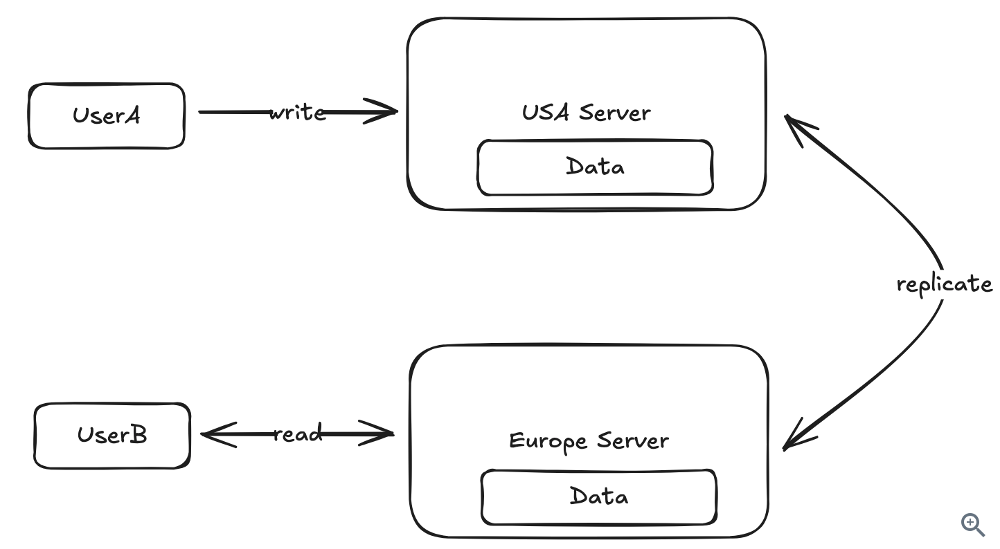

# CAP 定理

## 概述

CAP 定理是分布式系统设计中的基础理论，它阐述了在分布式系统中一致性（Consistency）和可用性（Availability）之间的根本权衡。这个定理在系统设计面试中经常是困扰候选人的一个知识点，但它对于你如何设计系统至关重要。

> 参考资料：[Hello Interview - CAP Theorem](https://www.hellointerview.com/learn/system-design/core-concepts/cap-theorem)

---

## 什么是 CAP 定理？

CAP 定理的核心观点是：在一个分布式系统中，你只能同时满足以下三个特性中的两个：

### 三个特性详解

#### 1. **一致性（Consistency）**

- 所有节点在同一时间看到相同的数据
- 当向一个节点写入数据后，从任何节点读取都会返回最新的值

#### 2. **可用性（Availability）**

- 每个对非故障节点的请求都会收到响应
- 但不保证返回的是最新版本的数据
- 系统始终可以响应用户请求

#### 3. **分区容错性（Partition Tolerance）**

- 系统在网络分区的情况下仍能继续运行
- 即使节点之间的消息丢失或部分系统故障，系统仍能正常工作

### 关键洞察 💡

**在任何分布式系统中，分区容错性（P）是必须的。** 网络故障是无法避免的，你的系统必须能够处理它们。

这意味着在实践中，**CAP 定理实际上简化为一个选择：**

> **当网络分区发生时，你是优先考虑一致性（C）还是可用性（A）？**

---

## 通过实例理解 CAP 定理

### 场景设置

假设你运行一个网站，有两台服务器 - 一台在美国，一台在欧洲。当用户更新他们的公开资料（比如显示名称）时：

1. 用户 A 连接到最近的服务器（美国）并更新名称
2. 这个更新被复制到欧洲的服务器
3. 当欧洲的用户 B 查看用户 A 的资料时，他们看到更新后的名称



### 网络分区场景

现在假设美国和欧洲服务器之间的连接中断了。此时我们面临关键决策：

当用户 B 尝试查看用户 A 的资料时，我们应该：

**选项 A：优先一致性（Consistency）**

- 返回错误，因为无法保证数据是最新的
- 系统拒绝提供可能过时的数据

**选项 B：优先可用性（Availability）**

- 显示可能过时的数据
- 系统保持可用，即使数据可能不是最新的


在这个案例中，**答案相当明确**：我们宁愿向欧洲用户显示用户 A 的旧名称，也不愿显示错误。看到过时的名称总比什么都看不到要好。

---

## 何时选择一致性（Consistency）

某些系统绝对需要一致性，即使要牺牲可用性：

### 1. 📝 订票系统

**场景：**

- 用户 A 预订了航班的 6A 座位
- 由于网络分区，用户 B 看到该座位仍然可用并也预订了它
- 结果：两个人都出现在同一个座位上！

**必须选择一致性：** 防止超卖

### 2. 🛒 电商库存系统

**场景：**

- 亚马逊只剩下最后一个牙刷
- 网络分区期间，系统向多个用户显示商品可用
- 结果：库存超卖

**必须选择一致性：** 确保库存准确

### 3. 💰 金融系统

**场景：**

- 股票交易平台需要显示准确的、最新的订单簿
- 显示过时的数据可能导致以错误的价格进行交易

**必须选择一致性：** 保证交易准确性

### 一致性优先的技术选择

**数据库：**

- 传统 RDBMS（PostgreSQL、MySQL）
- Google Spanner
- DynamoDB（强一致性模式）

**设计策略：**

- 分布式事务（两阶段提交）
- 单节点解决方案
- 同步复制

---

## 何时选择可用性（Availability）

大多数系统可以容忍一定程度的不一致性，应该优先考虑可用性。在这些情况下，**最终一致性**是可以接受的（系统最终会变得一致，但可能需要几秒钟或几分钟）。

### 1. 📱 社交媒体

**场景：**

- 用户 A 更新了他们的头像
- 用户 B 在几分钟内看到旧头像

**优先可用性：** 短暂的不一致是可以接受的

### 2. 🎬 内容平台（如 Netflix）

**场景：**

- 有人更新了电影描述
- 部分用户暂时看到旧描述

**优先可用性：** 临时显示过时信息不是灾难性的

### 3. ⭐ 评论网站（如 Yelp）

**场景：**

- 餐厅更新了营业时间
- 短暂显示过时信息

**优先可用性：** 显示略微过时的信息总比不显示信息要好

### 可用性优先的技术选择

**数据库：**

- Cassandra
- DynamoDB（多可用区配置）
- Redis 集群

**设计策略：**

- 多个副本（异步复制）
- Change Data Capture（CDC）
- 读写分离

---

## 关键问题

在做出选择时，问自己：

> **"如果用户短暂地看到不一致的数据，会是灾难性的吗？"**

- ✅ **是** → 选择一致性
- ❌ **否** → 选择可用性

---

## 在系统设计面试中应用 CAP 定理

### 讨论时机

CAP 定理应该是系统设计面试中**最先讨论的内容之一**，因为它会对你的整体设计产生重大影响。

### 典型面试流程

1. **对齐功能需求**（特性）
2. **定义非功能需求**（系统质量）← **在这里讨论 CAP！**
3. 设计系统架构

### 关键问题

在讨论非功能需求时，问：

> **"这个系统需要优先考虑一致性还是可用性？"**

### 优先一致性的设计方案

```
┌──────────────────────────────────────┐
│   优先一致性（Consistency First）      │
├──────────────────────────────────────┤
│ • 分布式事务（两阶段提交）               │
│ • 单节点方案                           │
│ • 同步复制                            │
│ • 强一致性读取                         │
│                                      │
│ 技术选择：                            │
│ - PostgreSQL/MySQL                  │
│ - Google Spanner                    │
│ - DynamoDB (强一致性模式)             │
└──────────────────────────────────────┘
```

**代价：**

- 更高的延迟
- 可能的服务不可用
- 更复杂的实现

### 优先可用性的设计方案

```
┌──────────────────────────────────────┐
│   优先可用性（Availability First）    │
├──────────────────────────────────────┤
│ • 多副本（异步复制）                  │
│ • Change Data Capture (CDC)         │
│ • 读写分离                           │
│ • 最终一致性                         │
│                                      │
│ 技术选择：                           │
│ - Cassandra                         │
│ - DynamoDB (多 AZ 配置)              │
│ - Redis 集群                         │
└──────────────────────────────────────┘
```

**代价：**

- 可能的数据不一致
- 需要处理冲突
- 复杂的客户端逻辑

---

## 高级概念（Senior/Staff 级别）

### 混合一致性模型

现实世界的系统通常需要**针对不同功能采用不同的一致性模型**。

#### 案例 1：Ticketmaster

同一个系统中需要不同的一致性级别：

| 功能         | 一致性选择     | 原因                     |
| ------------ | -------------- | ------------------------ |
| 预订座位     | **强一致性**   | 防止双重预订             |
| 查看活动详情 | **可用性优先** | 过时的活动描述是可接受的 |

**面试中可以这样说：**

> "对于这个订票系统，我会对预订交易优先考虑一致性，但在用户浏览和查看活动时优化可用性。"

#### 案例 2：Tinder

| 功能         | 一致性选择     | 原因                         |
| ------------ | -------------- | ---------------------------- |
| 匹配功能     | **强一致性**   | 双方同时右滑应该立即看到匹配 |
| 查看用户资料 | **可用性优先** | 看到略微过时的头像是可接受的 |

**面试中可以这样说：**

> "对于这个约会应用，我会对匹配功能优先考虑一致性，但在用户浏览资料时优化可用性。"

### 一致性级别谱系

一致性不是二元的，有多个级别：

#### 1. **强一致性（Strong Consistency）**

- 所有读取反映最新的写入
- 性能开销最大
- 用例：银行账户余额

#### 2. **因果一致性（Causal Consistency）**

- 相关事件对所有用户以相同顺序出现
- 确保依赖操作的逻辑顺序
- 用例：评论必须出现在帖子之后

#### 3. **读己之所写一致性（Read-Your-Own-Writes）**

- 用户总是立即看到自己的更新
- 其他用户可能看到旧版本
- 用例：社交媒体平台

#### 4. **最终一致性（Eventual Consistency）**

- 系统最终会变得一致，但可能暂时不一致
- 最宽松的一致性形式
- 用例：DNS 系统

```
强一致性 ←───────────────────→ 弱一致性
    │           │           │          │
  Strong    Causal    Read-Own    Eventual
    │           │           │          │
   高延迟    中等延迟    低延迟    最低延迟
   低可用    中等可用    高可用    最高可用
```

---

## 实战决策框架

### 步骤 1：识别系统类型

```
问：这个系统的核心操作是什么？

├─ 涉及金钱/库存/座位？
│  └─ 选择 C（一致性）
│
├─ 涉及内容展示/社交互动？
│  └─ 选择 A（可用性）
│
└─ 混合场景？
   └─ 为不同功能做不同选择
```

### 步骤 2：量化影响

| 问题                         | C（一致性） | A（可用性） |
| ---------------------------- | ----------- | ----------- |
| 数据不一致会导致金钱损失吗？ | ✅          | ❌          |
| 用户能容忍过时数据吗？       | ❌          | ✅          |
| 系统停机比数据不一致更糟吗？ | ❌          | ✅          |
| 需要支持离线操作吗？         | ❌          | ✅          |

### 步骤 3：明确表达你的选择

**在面试中，清晰地表达你的决策：**

> "对于这个 [系统类型]，我选择优先考虑 [一致性/可用性]，因为 [具体原因]。这意味着我们会 [具体实现策略]。"

**示例：**

> "对于这个电商系统，我选择对库存管理优先考虑一致性，因为超卖会导致客户不满和退款。这意味着我们会使用分布式事务来确保库存更新在所有节点上原子性地发生。对于产品浏览，我会优先考虑可用性，使用缓存和异步复制。"

---

## 常见误区 ⚠️

### 误区 1：CAP 是三选二

❌ **错误：** "我可以选择 CP 或 AP"  
✅ **正确：** "P 是必须的，所以我必须在 C 和 A 之间选择"

### 误区 2：选择是永久的

❌ **错误：** "整个系统必须是 CP 或 AP"  
✅ **正确：** "不同的功能可以做不同的选择"

### 误区 3：混淆 ACID 和 CAP 的一致性

❌ **错误：** 认为 CAP 的 C 等同于 ACID 的 C  
✅ **正确：** 它们是不同的概念

### 误区 4：忽略性能影响

❌ **错误：** 只考虑功能性影响  
✅ **正确：** 考虑延迟、吞吐量和用户体验

---

## 总结

### 核心要点

1. **CAP 定理很重要** - 它为你在面试中如何设计系统奠定了基础
2. **实际上是二选一** - 分区容错性是必须的，所以你要在一致性和可用性之间选择
3. **关键问题** - "每次读取都需要读到最新的写入吗？"
   - ✅ **是** → 优先一致性
   - ❌ **否** → 优先可用性
4. **灵活应用** - 同一系统的不同功能可以做不同选择

### 面试检查清单 ✓

- [ ] 在讨论非功能需求时提到 CAP 定理
- [ ] 明确说明选择 C 还是 A，并给出理由
- [ ] 考虑不同功能是否需要不同的一致性级别
- [ ] 说明技术选型如何支持你的 CAP 选择
- [ ] 讨论权衡和代价

### 快速参考表

| 系统类型 | 优先选择   | 常用技术              |
| -------- | ---------- | --------------------- |
| 订票系统 | 一致性 (C) | PostgreSQL, Spanner   |
| 金融交易 | 一致性 (C) | RDBMS + 分布式事务    |
| 电商库存 | 一致性 (C) | MySQL + 同步复制      |
| 社交媒体 | 可用性 (A) | Cassandra, DynamoDB   |
| 内容平台 | 可用性 (A) | Redis + 异步复制      |
| 评论网站 | 可用性 (A) | DynamoDB (最终一致性) |

---

## 延伸阅读

- **PACELC 定理** - CAP 的扩展，考虑了无分区情况下的权衡
- **分布式共识算法** - Paxos、Raft
- **最终一致性模式** - Vector Clocks、CRDTs
- **分布式事务** - 两阶段提交、Saga 模式

---

_最后更新：2026-01_
