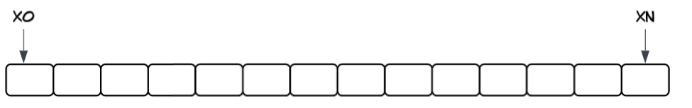
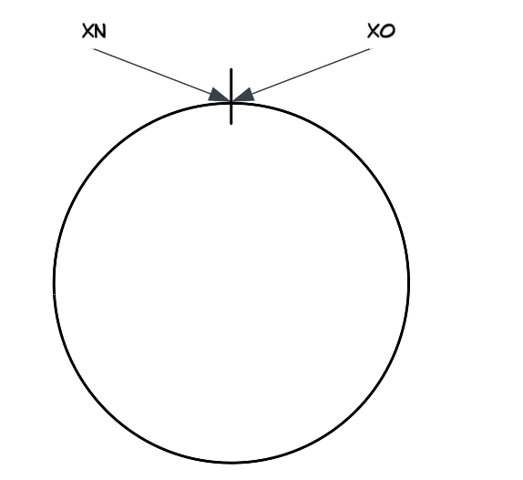
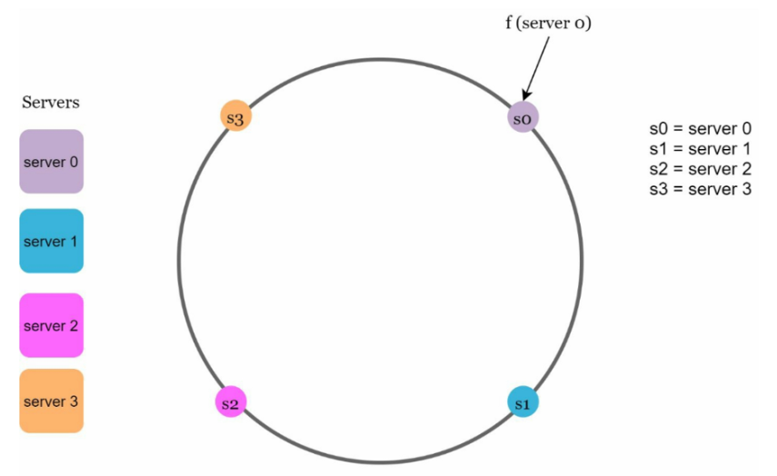
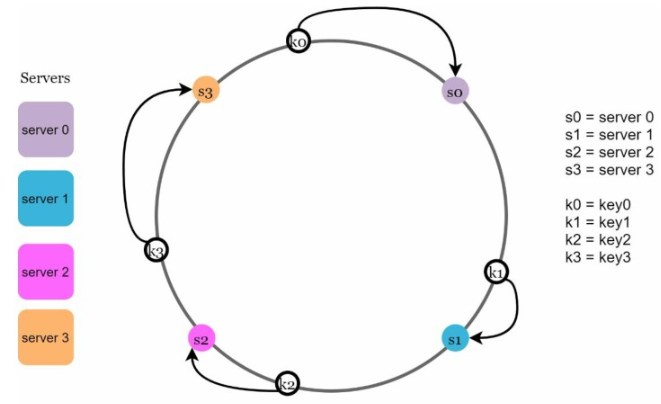
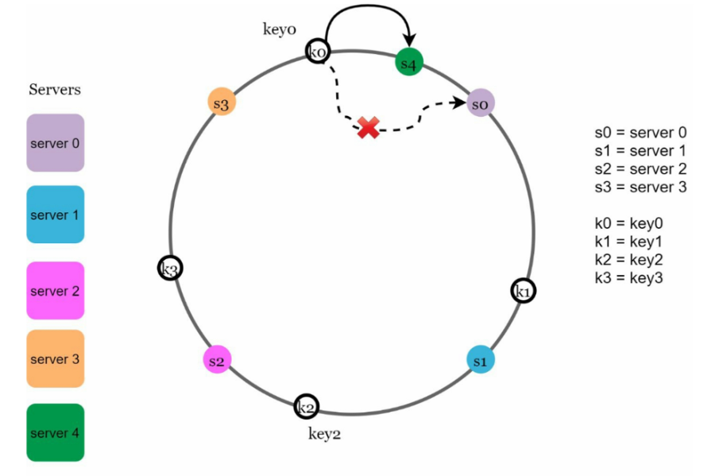
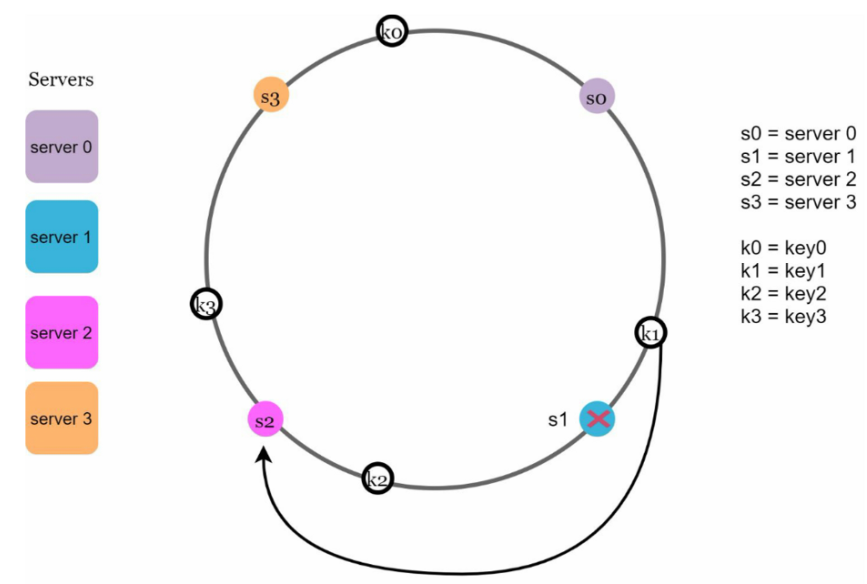
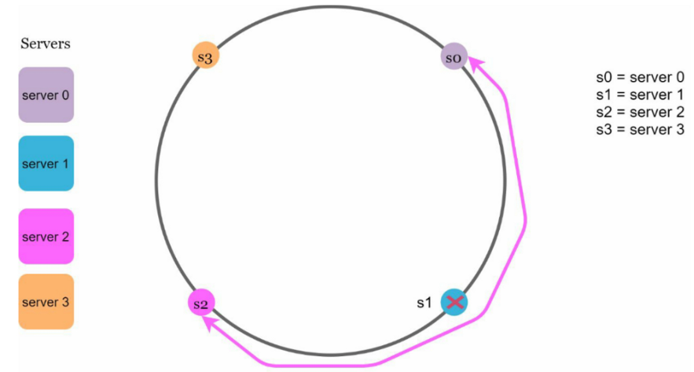
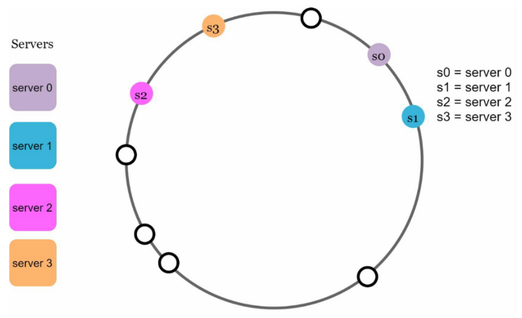
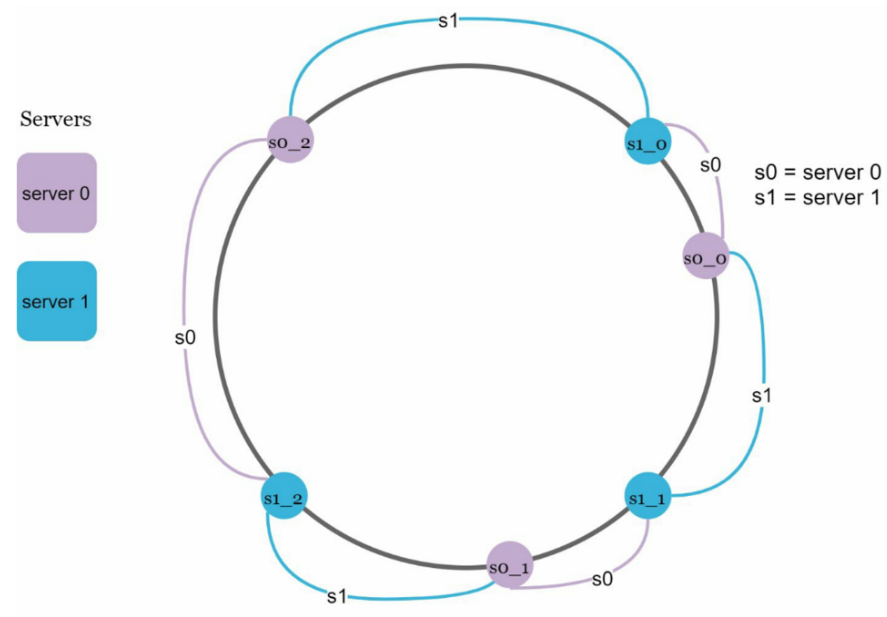
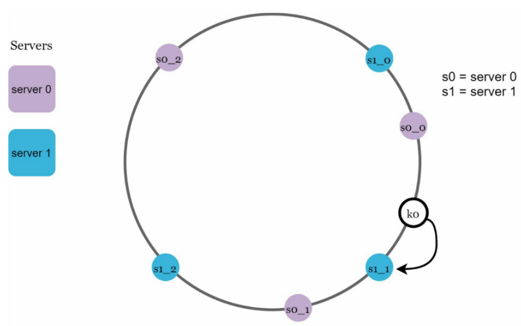

# 一致性哈希（Consistent Hashing）知识点总结

## 目录

- [问题背景](#问题背景)
- [一致性哈希概念](#一致性哈希概念)
- [核心原理](#核心原理)
- [虚拟节点优化](#虚拟节点优化)
- [节点变更处理](#节点变更处理)
- [优势与应用](#优势与应用)
- [实战案例](#实战案例)

---

## 问题背景

### 传统哈希方法

在分布式系统中，为了实现水平扩展和负载均衡，需要在多个服务器之间分配请求/数据。

**常用方法**：取模哈希

$$\text{serverIndex} = \text{hash(key)} \bmod N$$

其中：

- `N` 是服务器池的大小（例如 4 台服务器）
- `key` 是数据的唯一标识符（例如用户 ID、缓存键名、文件名等）
- `hash(key)` 是对 key 进行哈希运算得到的整数值

### 示例场景

假设有 4 个服务器和 8 个键：

| 键   | 哈希值   | 服务器索引 (hash % 4) |
| ---- | -------- | --------------------- |
| key0 | 18358617 | 1                     |
| key1 | 26143584 | 0                     |
| key2 | 18131146 | 2                     |
| key3 | 35863496 | 0                     |
| key4 | 34085809 | 1                     |
| key5 | 27581703 | 3                     |
| key6 | 38164978 | 2                     |
| key7 | 22530351 | 3                     |

**初始分布**：

```
Server 0: key1, key3
Server 1: key0, key4
Server 2: key2, key6
Server 3: key5, key7
```

### 再哈希问题（Rehashing Problem）

**场景**：当服务器 1 下线，服务器池大小变为 3

使用 `hash % 3` 重新计算：

| 键   | 哈希值   | 原服务器 (% 4) | 新服务器 (% 3) | 是否迁移 |
| ---- | -------- | -------------- | -------------- | -------- |
| key0 | 18358617 | 1              | 0              | ✅       |
| key1 | 26143584 | 0              | 0              | ❌       |
| key2 | 18131146 | 2              | 1              | ✅       |
| key3 | 35863496 | 0              | 1              | ✅       |
| key4 | 34085809 | 1              | 1              | ✅       |
| key5 | 27581703 | 3              | 1              | ✅       |
| key6 | 38164978 | 2              | 0              | ✅       |
| key7 | 22530351 | 3              | 0              | ✅       |

**问题严重性**：

- ❌ **大量键重新分配**：8 个键中有 7 个需要迁移（87.5%）
- ❌ **缓存失效风暴**：大部分客户端会连接到错误的服务器
- ❌ **雪崩效应**：数据库压力骤增，可能导致系统崩溃

### 问题本质

> 💡 **核心问题**：传统取模哈希在服务器数量变化时，几乎所有键都需要重新映射。

---

## 一致性哈希概念

### 定义

> **一致性哈希**（Consistent Hashing）是一种特殊的哈希技术，当哈希表大小变化时，平均只需要重新映射 `k/n` 个键。
>
> - `k` = 键的数量
> - `n` = 槽的数量

**对比**：

| 方法           | 服务器变化时需要迁移的键 |
| -------------- | ------------------------ |
| **传统哈希**   | 几乎所有键（~100%）      |
| **一致性哈希** | 平均只有 k/n（少量键）   |

### 目标

- ✅ 最小化键的重新分配
- ✅ 实现水平扩展
- ✅ 均匀分布数据
- ✅ 减少缓存失效

---

## 核心原理

### 1. 哈希空间和哈希环

#### 哈希空间

假设使用 **SHA-1** 作为哈希函数：

- **输出范围**：0 到 $2^{160} - 1$
- **哈希空间**：$x_0, x_1, x_2, ..., x_n$



#### 哈希环

将哈希空间的两端连接起来，形成一个环形结构：



### 2. 哈希服务器

使用相同的哈希函数，根据服务器的 **IP 或名称**将服务器映射到环上：



### 3. 哈希键

将数据的键也映射到哈希环上：


### 4. 服务器查找规则

> 💡 **核心规则**：从键的位置开始，**顺时针方向**查找，遇到的第一个服务器就是该键对应的服务器。

**示例**：



- `key0` → 顺时针找到 `s0`
- `key1` → 顺时针找到 `s1`
- `key2` → 顺时针找到 `s2`
- `key3` → 顺时针找到 `s3`

---

## 节点变更处理

### 添加服务器

**场景**：在 s3 和 s0 之间添加 `server4`



**影响范围**：

- ✅ 只有 `s3` 到 `s4` 之间的键需要迁移到 `s4`
- ✅ 其他键保持不变

**示例**：

```
原来：key0 → s0
现在：key0 → s4 (因为 s4 在 key0 顺时针方向更近)
```

### 移除服务器

**场景**：移除 `server1`



**影响范围**：

- ✅ 只有原本指向 `s1` 的键需要重新映射到 `s2`（顺时针下一个）
- ✅ 其他键保持不变

**示例**：

```
原来：key1 → s1
现在：key1 → s2 (s1 的顺时针下一个服务器)
```

---

## 基本方法的两个问题

### 问题 1：分区大小不均匀

**定义**：分区 = 相邻服务器之间的哈希空间

**场景**：服务器在环上的分布不均匀



**问题**：

- ❌ `s1` 的分区很大 → 存储大量数据
- ❌ `s0` 的分区很小 → 存储很少数据
- ❌ 负载不均衡，某些服务器压力过大

### 问题 2：键分布不均匀

**场景**：服务器聚集在环的某个区域



**问题**：

- ❌ 大部分键存储在 `s3` 上
- ❌ `s0`、`s1`、`s2` 几乎没有数据
- ❌ 严重的负载不均衡

---

## 虚拟节点优化

### 核心思想

> 💡 **虚拟节点（Virtual Nodes）**：每个物理服务器在环上对应多个虚拟节点，通过增加节点数量来实现更均匀的分布。

### 实现方式

**物理服务器**：`server0`, `server1`

**虚拟节点**：

- `server0` → `s0_0`, `s0_1`, `s0_2`（3 个虚拟节点）
- `server1` → `s1_0`, `s1_1`, `s1_2`（3 个虚拟节点）



### 虚拟节点的创建

```python
def create_virtual_nodes(server_name, num_virtual_nodes):
    """为物理服务器创建多个虚拟节点"""
    virtual_nodes = []
    for i in range(num_virtual_nodes):  # 遍历虚拟节点数量
        virtual_node_name = f"{server_name}_#{i}"  # 生成虚拟节点名称，如 "server0_#0"
        hash_value = hash_function(virtual_node_name)  # 计算虚拟节点在哈希环上的位置
        virtual_nodes.append((hash_value, server_name))  # 存储 (哈希值, 物理服务器名) 元组
    return virtual_nodes

# 示例
create_virtual_nodes("server0", 3)
# 返回：
# [(hash("server0_#0"), "server0"),
#  (hash("server0_#1"), "server0"),
#  (hash("server0_#2"), "server0")]
```

### 查找流程

1. **键的哈希**：`hash(key0) → 环上某个位置`
2. **顺时针查找**：找到第一个虚拟节点（如 `s1_1`）
3. **映射到物理服务器**：`s1_1` → `server1`
4. **结果**：`key0` 存储在 `server1`

**示例**：



### 虚拟节点数量的影响

#### 标准偏差分析

| 虚拟节点数量 | 标准偏差 | 数据分布 |
| ------------ | -------- | -------- |
| 10           | ~15-20%  | 🟡 一般  |
| 100          | ~10%     | 🟢 良好  |
| 200          | ~5%      | ✅ 优秀  |
| 1000         | ~1-2%    | ✅ 极优  |

**权衡**：

- ✅ 虚拟节点越多 → 分布越均匀
- ❌ 虚拟节点越多 → 内存占用越大
- 💡 推荐：100-200 个虚拟节点（平衡性能和资源）

### 负载均衡效果

**无虚拟节点**：

```
Server 0: ████████████████████ 60%
Server 1: ██ 5%
Server 2: ████████ 25%
Server 3: ████ 10%
```

**使用 150 个虚拟节点**：

```
Server 0: ██████ 24%
Server 1: ██████ 26%
Server 2: ██████ 25%
Server 3: ██████ 25%
```

---

## 实现细节

### 数据结构

```python
class ConsistentHash:
    def __init__(self, num_virtual_nodes=150):
        self.num_virtual_nodes = num_virtual_nodes
        self.ring = {}  # {hash_value: server_name}
        self.sorted_keys = []  # 排序后的哈希值列表
        self.servers = set()

    def _hash(self, key):
        """哈希函数（SHA-1）"""
        import hashlib
        return int(hashlib.sha1(key.encode('utf-8')).hexdigest(), 16)

    def add_server(self, server_name):
        """添加服务器"""
        self.servers.add(server_name)
        for i in range(self.num_virtual_nodes):
            virtual_node = f"{server_name}_#{i}"
            hash_value = self._hash(virtual_node)
            self.ring[hash_value] = server_name
            self.sorted_keys.append(hash_value)

        # 保持哈希值排序
        self.sorted_keys.sort()

    def remove_server(self, server_name):
        """移除服务器"""
        self.servers.discard(server_name)
        for i in range(self.num_virtual_nodes):
            virtual_node = f"{server_name}_#{i}"
            hash_value = self._hash(virtual_node)
            if hash_value in self.ring:
                del self.ring[hash_value]
                self.sorted_keys.remove(hash_value)

    def get_server(self, key):
        """查找键对应的服务器"""
        if not self.ring:
            return None

        hash_value = self._hash(key)

        # 二分查找：找到第一个 >= hash_value 的位置
        idx = self._binary_search(hash_value)

        # 返回对应的服务器
        return self.ring[self.sorted_keys[idx]]

    def _binary_search(self, hash_value):
        """二分查找顺时针方向的第一个节点"""
        left, right = 0, len(self.sorted_keys) - 1

        # 如果 hash_value 大于最大值，返回第一个节点（环形）
        if hash_value > self.sorted_keys[-1]:
            return 0

        while left < right:
            mid = (left + right) // 2
            if self.sorted_keys[mid] < hash_value:
                left = mid + 1
            else:
                right = mid

        return left
```

### 使用示例

```python
# 创建一致性哈希实例
ch = ConsistentHash(num_virtual_nodes=150)

# 添加服务器
ch.add_server("server0")
ch.add_server("server1")
ch.add_server("server2")
ch.add_server("server3")

# 查找键对应的服务器
print(ch.get_server("key0"))  # 输出: server1
print(ch.get_server("key1"))  # 输出: server2
print(ch.get_server("key2"))  # 输出: server0

# 添加新服务器
ch.add_server("server4")
print(ch.get_server("key0"))  # 可能仍然是 server1（大部分键不变）

# 移除服务器
ch.remove_server("server1")
print(ch.get_server("key0"))  # 自动迁移到下一个服务器
```

### 时间复杂度

| 操作       | 时间复杂度 | 说明                       |
| ---------- | ---------- | -------------------------- |
| 添加服务器 | O(V log V) | V = 虚拟节点数量           |
| 移除服务器 | O(V log V) | 需要排序                   |
| 查找服务器 | O(log N)   | N = 总虚拟节点数，二分查找 |
| 空间复杂度 | O(S × V)   | S = 服务器数量             |

---

## 优势与应用

### 核心优势

| 优势             | 说明                                   |
| ---------------- | -------------------------------------- |
| **最小化迁移**   | 添加/删除服务器时，只影响少量键（k/n） |
| **水平扩展**     | 易于动态增加/减少服务器                |
| **均匀分布**     | 通过虚拟节点实现负载均衡               |
| **缓解热点问题** | 避免某些分片过载                       |
| **高可用性**     | 单点故障只影响部分数据                 |
| **去中心化**     | 无需中心化协调器                       |

### 与传统哈希的对比

| 维度           | 传统哈希（取模）  | 一致性哈希        |
| -------------- | ----------------- | ----------------- |
| **键迁移比例** | ~100%             | k/n（少量）       |
| **扩展性**     | ❌ 困难           | ✅ 容易           |
| **负载均衡**   | 🟡 依赖服务器数   | ✅ 虚拟节点保证   |
| **容错性**     | ❌ 单点故障影响大 | ✅ 单点故障影响小 |
| **实现复杂度** | ✅ 简单           | 🟡 中等           |

---

## 实战案例

### 1. Amazon Dynamo

**应用场景**：分布式键值存储

**实现方式**：

- 使用一致性哈希进行数据分区
- 每个节点负责环上的一个或多个范围
- 自动数据复制和故障恢复

**优势**：

- 高可用性（99.99%）
- 水平扩展能力强
- 最终一致性

### 2. Apache Cassandra

**应用场景**：跨集群的数据分区

**实现方式**：

- 使用一致性哈希进行数据分片
- 虚拟节点（vnodes）实现负载均衡
- 支持数据中心感知

**特点**：

```
每个节点：256 个虚拟节点（默认）
分区键：使用 Murmur3 哈希函数
副本策略：根据哈希环位置自动分配
```

### 3. Discord 聊天应用

**应用场景**：消息路由和存储

**挑战**：

- 500 万并发用户
- 高实时性要求
- 动态扩展

**解决方案**：

- 使用一致性哈希分配聊天室到服务器
- 虚拟节点保证负载均衡
- 服务器故障时快速重新分配

### 4. Akamai CDN

**应用场景**：内容分发网络

**实现方式**：

- 一致性哈希分配内容到边缘服务器
- 最小化缓存失效
- 动态添加/移除边缘节点

### 5. Maglev 网络负载均衡器

**应用场景**：Google 的网络负载均衡

**特点**：

- 改进的一致性哈希算法
- 更快的查找速度
- 更好的连接亲和性

---

## 进阶话题

### 1. 带权重的一致性哈希

**场景**：服务器性能不同，需要按能力分配负载

**实现**：

```python
def add_server_with_weight(server_name, weight):
    """
    根据权重添加虚拟节点
    权重越高，虚拟节点越多
    """
    num_vnodes = base_vnodes * weight
    for i in range(num_vnodes):
        virtual_node = f"{server_name}_#{i}"
        hash_value = hash_function(virtual_node)
        ring[hash_value] = server_name
```

**示例**：

```
高性能服务器：300 个虚拟节点 → 承担 30% 负载
普通服务器：  150 个虚拟节点 → 承担 15% 负载
低性能服务器：50 个虚拟节点  → 承担 5% 负载
```

### 2. 有界负载一致性哈希

**问题**：标准一致性哈希仍可能导致某些节点过载

**解决方案**：设置负载上限

```python
def get_server_with_bounded_load(key, max_load_factor=1.25):
    """
    查找服务器，确保不超过平均负载的 125%
    """
    avg_load = total_keys / num_servers
    max_load = avg_load * max_load_factor

    hash_value = hash(key)
    idx = binary_search(hash_value)

    # 顺时针查找负载未满的服务器
    while current_load[server] >= max_load:
        idx = (idx + 1) % len(sorted_keys)
        server = ring[sorted_keys[idx]]

    return server
```

### 3. 跳跃一致性哈希

**优化目标**：减少查找时间，避免二分查找

**实现**：使用跳跃表加速查找

```python
class JumpConsistentHash:
    def get_server(self, key, num_servers):
        """
        O(log n) 查找，无需存储环
        """
        b, j = -1, 0
        while j < num_servers:
            b = j
            key = ((key * 2862933555777941757) + 1) & 0xFFFFFFFFFFFFFFFF
            j = int((b + 1) * (float(1 << 31) / float((key >> 33) + 1)))
        return b
```

---

## 常见问题（FAQ）

### Q1: 虚拟节点数量如何选择？

**A**:

- **小规模系统**（< 10 台服务器）：50-100 个虚拟节点
- **中等规模**（10-100 台）：100-200 个虚拟节点
- **大规模系统**（> 100 台）：150-300 个虚拟节点

权衡标准偏差和内存占用。

### Q2: 一致性哈希能保证强一致性吗？

**A**: 不能。一致性哈希只负责数据分布，不保证一致性。需要结合：

- 复制策略（多副本）
- 一致性协议（Paxos、Raft）
- 读写策略（Quorum）

### Q3: 如何处理服务器性能差异？

**A**: 使用**带权重的一致性哈希**：

- 高性能服务器：更多虚拟节点
- 低性能服务器：更少虚拟节点

### Q4: 一致性哈希的缺点是什么?

**A**:

- ❌ 实现复杂度较高
- ❌ 虚拟节点占用额外内存
- ❌ 仍有小概率的负载不均（通过增加虚拟节点缓解）
- ❌ 不适合需要范围查询的场景

### Q5: 什么时候不适合用一致性哈希？

**A**:

- 服务器数量固定且很少变化
- 需要范围查询（如数据库分片）
- 对数据局部性有强需求
- 系统规模很小（< 3 台服务器）

---

## 设计模式总结

### 适用场景

✅ **推荐使用**：

- 分布式缓存（Redis、Memcached）
- 分布式存储（Cassandra、Dynamo）
- 负载均衡器
- CDN 内容分发
- 消息队列分区
- 微服务路由

❌ **不推荐使用**：

- 固定分片数量的系统
- 需要范围查询的数据库
- 小规模系统（< 3 节点）
- 强一致性要求的系统

### 实施步骤

1. **选择哈希函数**：SHA-1、MD5、Murmur3
2. **确定虚拟节点数量**：根据集群规模决定（100-200）
3. **实现哈希环**：使用有序数据结构（TreeMap、SortedList）
4. **添加服务器**：创建虚拟节点并加入环
5. **路由请求**：二分查找顺时针最近的节点
6. **监控负载**：确保分布均匀，调整虚拟节点数量

### 性能优化建议

| 优化点       | 建议                     |
| ------------ | ------------------------ |
| **查找速度** | 使用二分查找（O(log n)） |
| **内存占用** | 只存储哈希值和服务器映射 |
| **负载均衡** | 调整虚拟节点数量         |
| **容错能力** | 结合数据复制策略         |
| **监控告警** | 实时监控各节点负载       |

---


## 总结

### 核心要点

1. **问题本质**：传统哈希在节点变化时需要重新映射所有键
2. **解决方案**：一致性哈希 + 虚拟节点
3. **关键机制**：
   - 哈希环
   - 顺时针查找
   - 虚拟节点实现负载均衡
4. **适用场景**：分布式缓存、存储、负载均衡

### 设计权衡

| 方面           | 权衡                          |
| -------------- | ----------------------------- |
| **虚拟节点**   | 更多节点 = 更均匀 vs 更多内存 |
| **哈希函数**   | 更快速度 vs 更好分布          |
| **复制因子**   | 更高可用性 vs 更多存储开销    |
| **实现复杂度** | 更简单实现 vs 更多高级特性    |

### 最佳实践

✅ **推荐做法**：

1. 使用 150-200 个虚拟节点
2. 选择 SHA-1 或 Murmur3 哈希函数
3. 使用有序数据结构（TreeMap、SortedList）
4. 实现负载监控和告警
5. 结合数据复制策略提高可用性

❌ **避免做法**：

1. 虚拟节点太少（< 50）
2. 不监控负载分布
3. 在小规模系统中使用（< 3 节点）
4. 期望完美的负载均衡（允许一定偏差）

---

## 参考资料

### 学术论文

1. **Consistent Hashing and Random Trees**  
   Karger et al., MIT, 1997  
   https://www.akamai.com/us/en/multimedia/documents/technical-publication/consistent-hashing-and-random-trees-distributed-caching-protocols-for-relieving-hot-spots-on-the-world-wide-web-technical-publication.pdf

2. **Web Caching with Consistent Hashing**  
   David Karger et al., MIT, 1999

### 工业实践

3. **Dynamo: Amazon's Highly Available Key-value Store**  
   https://www.allthingsdistributed.com/files/amazon-dynamo-sosp2007.pdf

4. **Cassandra - A Decentralized Structured Storage System**  
   http://www.cs.cornell.edu/Projects/ladis2009/papers/Lakshman-ladis2009.PDF

5. **How Discord Scaled Elixir to 5,000,000 Concurrent Users**  
   https://blog.discord.com/scaling-elixir-f9b8e1e7c29b

6. **Maglev: A Fast and Reliable Software Network Load Balancer**  
   https://research.google/pubs/pub44824/

### 在线资源

7. **Consistent Hashing Visualization**  
   http://www.tom-e-white.com/2007/11/consistent-hashing.html

8. **Wikipedia: Consistent Hashing**  
   https://en.wikipedia.org/wiki/Consistent_hashing

---

**恭喜你完成一致性哈希的学习！** 🎉

现在你已经掌握了：

- ✅ 一致性哈希的核心原理
- ✅ 虚拟节点优化技术
- ✅ 生产级代码实现
- ✅ 真实系统应用案例

继续加油，将这些知识应用到实际项目中！💪
